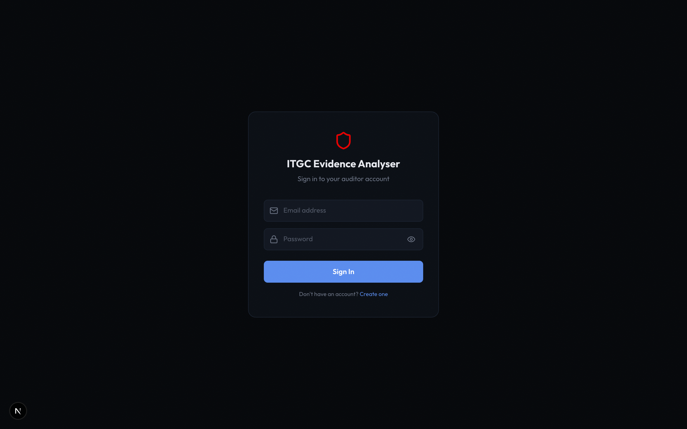
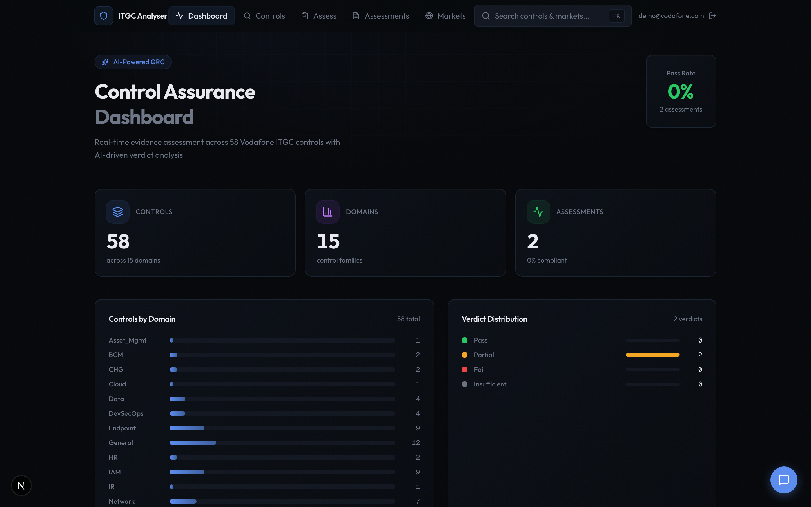
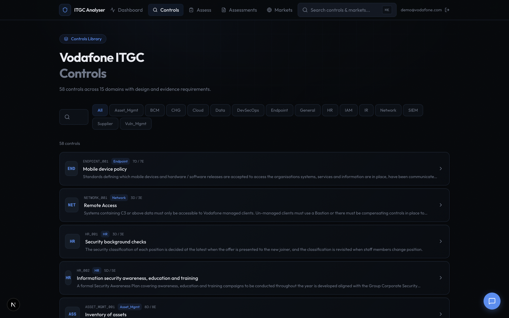
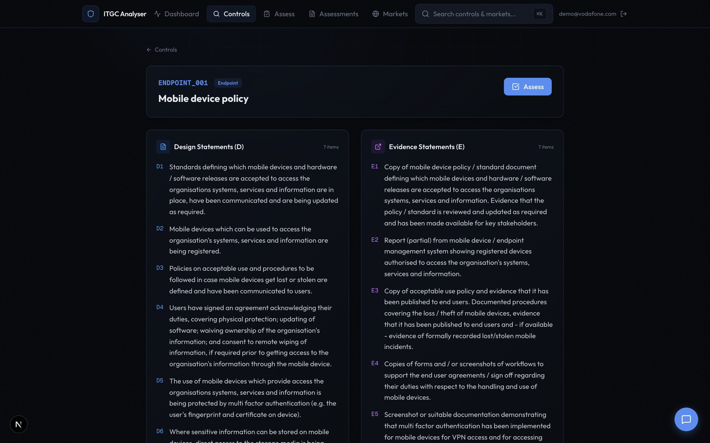
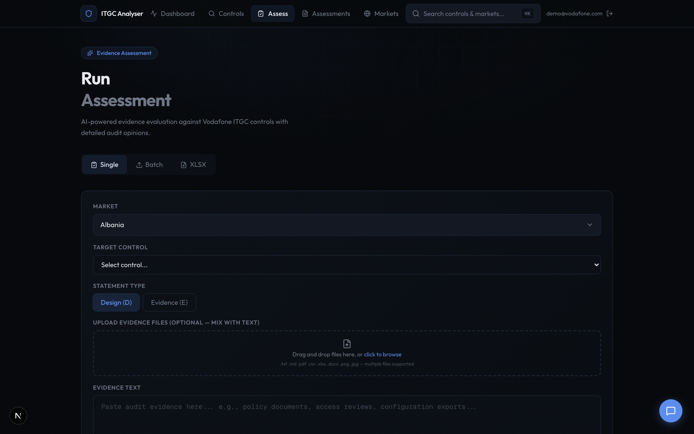
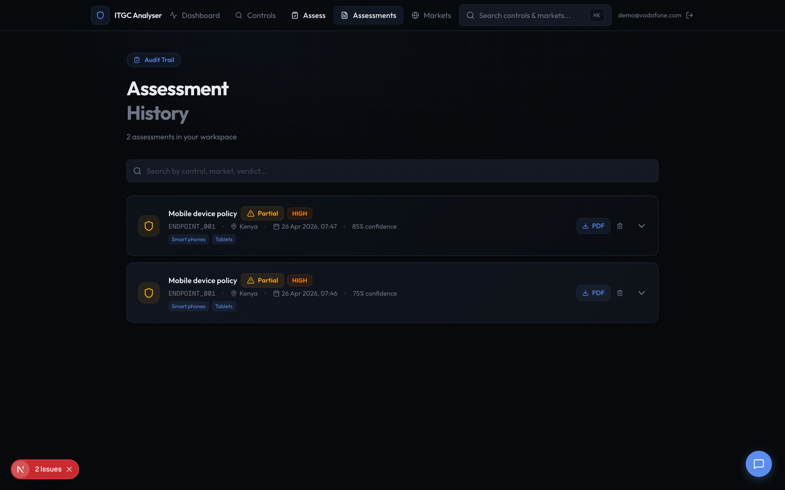
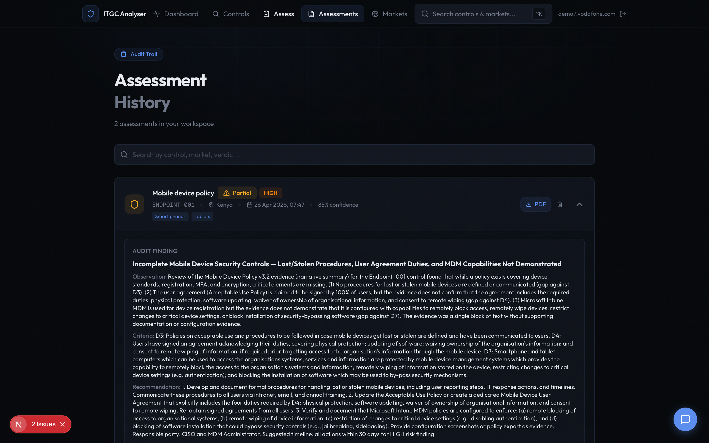
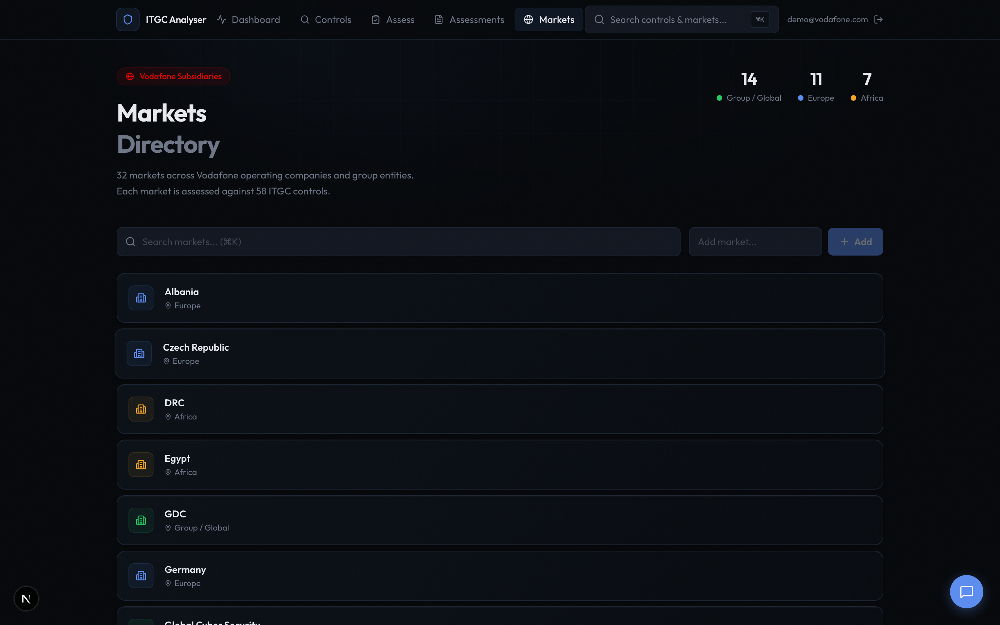

# ITGC Evidence Analyser — Demo Walkthrough

AI-powered audit evidence assessment for Vodafone IT General Controls.

---

## 1. Login & Registration

Auditors sign in with email and password. New auditors self-register at `/register`. Each auditor gets an isolated workspace — assessments are private.

---

## 2. Dashboard

Real-time overview of all assessments in your workspace. Verdict distribution, domain breakdown, and quick links to run new assessments or view history.

---

## 3. Controls Library

All 58 Vodafone ITGC controls across 10 domains. Searchable by control ID, name, domain, or statement text. Filter by domain to narrow down.

---

## 4. Control Detail

Detailed view of each control showing all D (Design) and E (Evidence) statements. Each statement is what the AI assessor evaluates evidence against.

---

## 5. Assessment Runner

The core workflow: select Market → Control → Samples in Scope → Statement Type → Upload Evidence → Run Assessment. Multi-file upload supports PDF, DOCX, XLSX, CSV, images, and plain text. AI returns structured verdict within 60 seconds.

---

## 6. Assessment History

Complete audit trail of all assessments. Search by market, control, or verdict. Expand any card to see full finding details, evidence inventory, and requirements assessment table. Download professional PDF reports. Delete unwanted assessments with confirmation.

---

## 7. Assessment Report (Expanded)

Click any assessment to expand — full audit finding (title, observation, criteria, risk impact, recommendation), compliance gaps, requirements assessment table, evidence inventory, limitations, follow-up questions, and remediation notes. Everything needed for control owner sign-off.

---

## 8. Markets Directory

32 Vodafone subsidiaries organised by region (Europe, Africa, Group/Global). Admins can add, rename, or remove markets as the portfolio evolves.

---

## Key Capabilities

- **58 ITGC controls** across 10 domains, 32 markets
- **AI assessment** via Claude Sonnet 4.6 with audit-grade structured output
- **Multi-file evidence** — PDF, DOCX, XLSX, CSV, images, text
- **AI Chatbot** — conversational interface to re-examine evidence and amend verdicts
- **PDF export** — professional Vodafone-branded audit reports with findings, evidence inventory, and remediation guidance
- **Multi-user** — JWT authentication with workspace isolation and audit trail
- **52 automated tests** — full test coverage

## Technical Stack

| Layer | Technology |
|-------|-----------|
| Frontend | Next.js 16, React 19, Framer Motion, Tailwind CSS |
| Backend | Python FastAPI, Anthropic Claude SDK |
| Database | SQLite with 7 tables |
| Auth | JWT + bcrypt, role-based access |
| Deployment | Docker, Nginx, Supervisor → Azure Container Apps |
