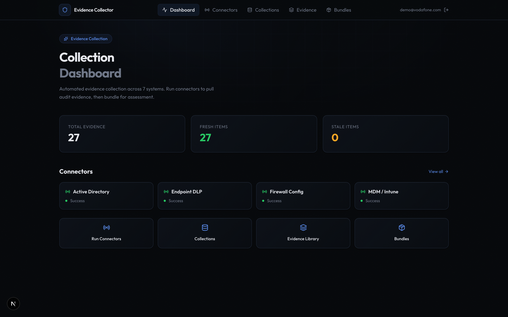
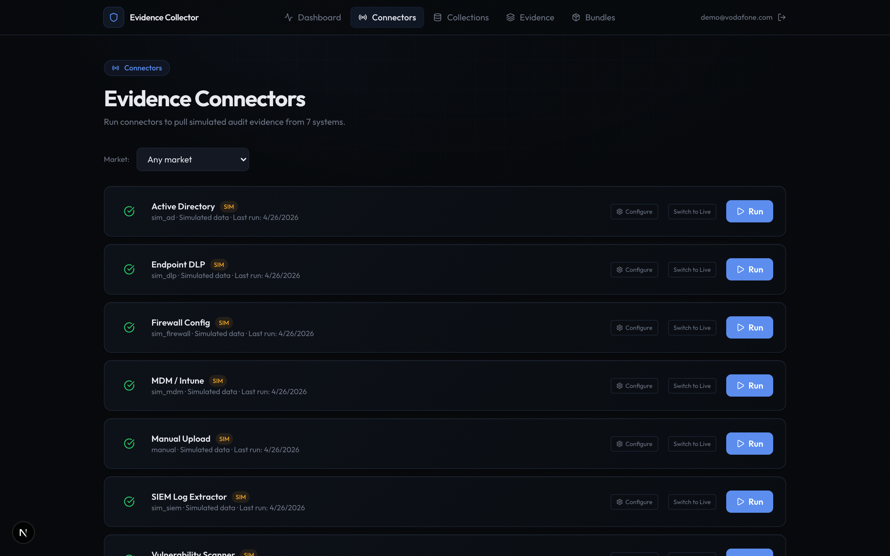
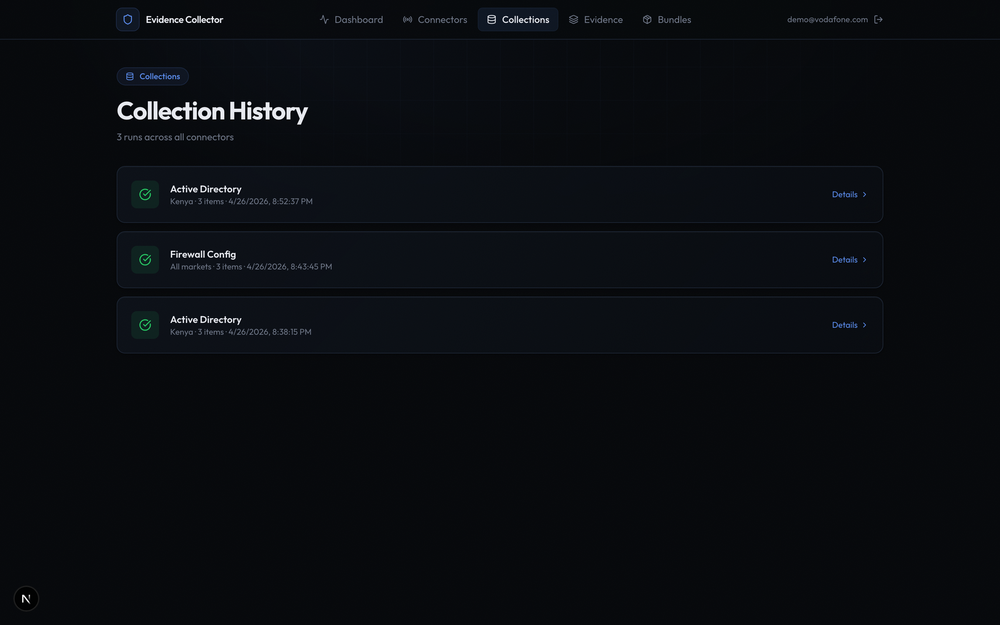
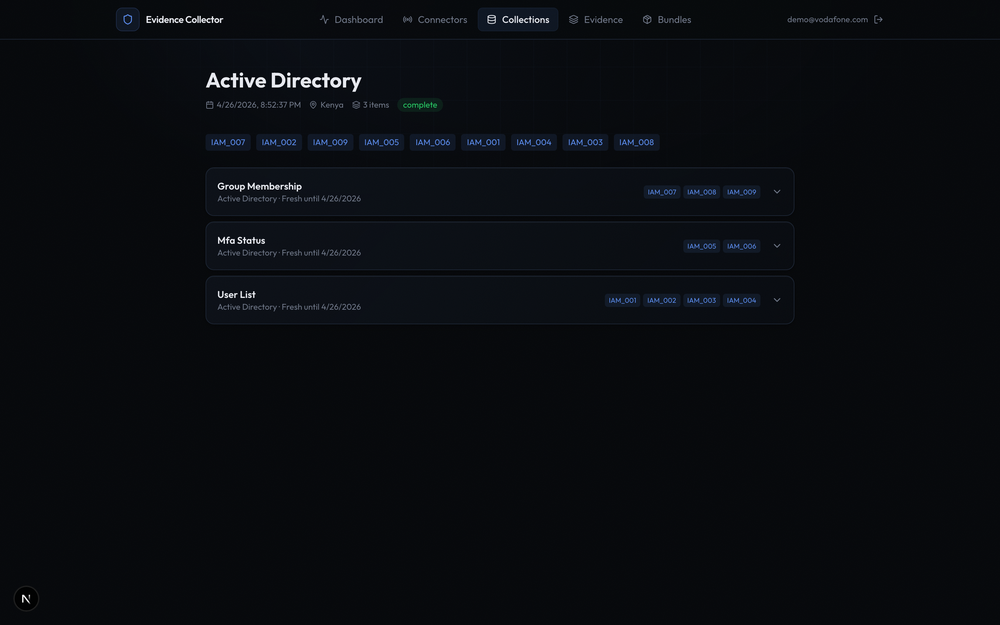
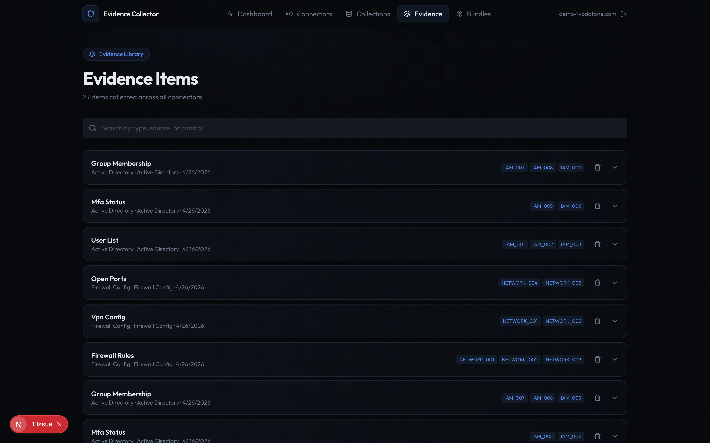
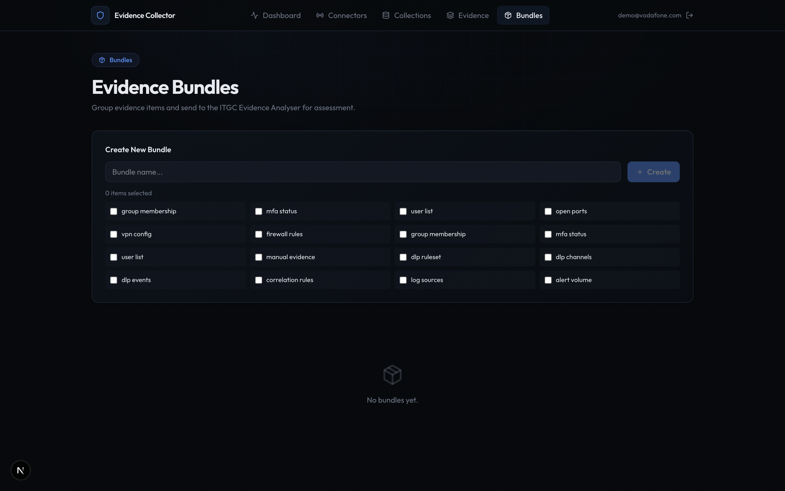
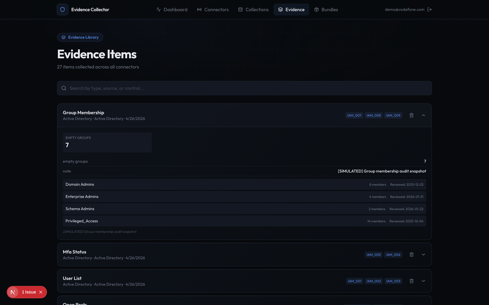

# Evidence Collection Automation — Demo Walkthrough

Automated audit evidence collection across 7 enterprise systems. Two-mode architecture: simulated for demo, live for real Vodafone production systems.

---

## 1. Login & Authentication

Auditors sign in with email and password. JWT-based auth with bcrypt password hashing and workspace isolation — each auditor sees only their own collections and bundles. Registration available at `/register`.

---

## 2. Dashboard

Real-time overview of evidence collection status. Freshness stats, connector status grid (idle/running/success/error), evidence counts by connector, and quick links to run collections, view evidence, or create bundles.

---

## 3. Connectors — Live & Simulated

7 connectors with SIM/LIVE mode badges. Each connector shows its current mode, last run timestamp, and status. The **Switch to Live** button toggles between simulated demo data and real system integration. Select a market from the 32 Vodafone subsidiaries dropdown, then click **Run** to trigger collection.

---

## 4. Collection History

Chronological history of all collection runs. Each entry shows the connector name, market, status (complete/running/error), evidence count, and mapped control IDs. Click any collection to drill into the evidence items.

---

## 5. Collection Detail — Formatted Evidence

Expanded collection view showing all evidence items with formatted rendering. Evidence data appears as readable tables, stat grids, and severity-colored cards — never raw JSON. Each item shows source system, control mappings, and freshness date.

---

## 6. Evidence Library

Full evidence inventory across all connectors. Search by type, source system, or control ID. Expand any card to see rendered evidence — user tables, device compliance with pass/fail badges, firewall rules, vulnerability cards with CVSS scores, and SIEM alert severity dots. Delete items with confirmation.

---

## 7. Bundle Builder

Create audit-ready evidence bundles. Multi-select evidence items, name the bundle, add description and control IDs, then **Export** as downloadable JSON. The **Assess** button sends the bundle directly to Project 1's ITGC Evidence Analyser for AI-powered control assessment against Vodafone D/E statements.

---

## 8. Evidence Rendering

Close-up of the evidence renderer converting structured JSON into:
- **Stat grids** — numeric key-value pairs in compact cards
- **Distribution bars** — colored proportional bars for MFA methods, severity counts, OS versions
- **User tables** — columnar display with group memberships
- **Device tables** — enrollment status with compliant/non-compliant badges
- **Firewall rule tables** — allow/deny action badges, log status
- **Vulnerability cards** — severity-colored with CVSS scores and patch availability
- **Alert lists** — severity dot indicators with status
- **Channel config** — DLP channel protection status badges

---

## Integration Architecture

Each connector runs in one of two modes controlled by a database field:

| Connector | Simulated | Live System | API/Protocol |
|-----------|-----------|-------------|-------------|
| Active Directory | 25-60 fake users | Azure AD/Entra ID or on-prem AD | Microsoft Graph, LDAP |
| MDM / Intune | 40-80 fake devices | Vodafone Intune tenant or Workspace ONE | Microsoft Graph, REST |
| Firewall Config | 30-80 fake rules | Palo Alto Panorama, Check Point, FortiGate | REST API, SSH |
| Vulnerability Scanner | 15-40 fake CVEs | Tenable.io, Qualys, Rapid7 | REST API |
| SIEM Log Extractor | 20-60 fake alerts | Microsoft Sentinel, Splunk, QRadar | KQL, REST API |
| Endpoint DLP | 15-40 fake events | Microsoft Purview, Symantec DLP | Graph API, REST |
| Manual Upload | N/A | Auditor-provided files | File upload |

### Enabling Live Mode

1. Set `INTEGRATION_MODE=live` environment variable
2. Patch connector with credentials via API: `PATCH /api/v1/connectors/{id}` with `mode: "live"` and `auth_config`
3. Trigger collection — connector calls real system API instead of generating fake data

All collection output goes through the same normaliser → same EvidenceItem shape → same bundle → same assessment pipeline regardless of data source.

---

## Key Capabilities

- **7 system connectors** — AD, MDM, Firewall, Vuln Scanner, SIEM, DLP, Manual Upload
- **Dual-mode architecture** — simulated demo data or live system integration
- **32 Vodafone markets** — cross-subsidiary evidence collection
- **Formatted evidence rendering** — tables, stat grids, distribution bars, severity badges
- **Evidence bundling** — audit-ready JSON packages
- **Cross-project integration** — one-click assessment handoff to Project 1
- **JWT authentication** — workspace isolation per auditor
- **CLI + API + Frontend** — three access modes

## Technical Stack

| Layer | Technology |
|-------|-----------|
| Frontend | Next.js 16, React 19, Framer Motion, Tailwind CSS |
| Backend | Python FastAPI |
| Database | SQLite (WAL mode, foreign keys) |
| Auth | JWT + bcrypt, workspace isolation |
| Integration | Microsoft Graph, LDAP, SSH, REST APIs |

## Demo Credentials

- **URL**: `http://localhost:3001`
- **Email**: `admin@vodafone.com`
- **Password**: `GRCadmin2026!`
