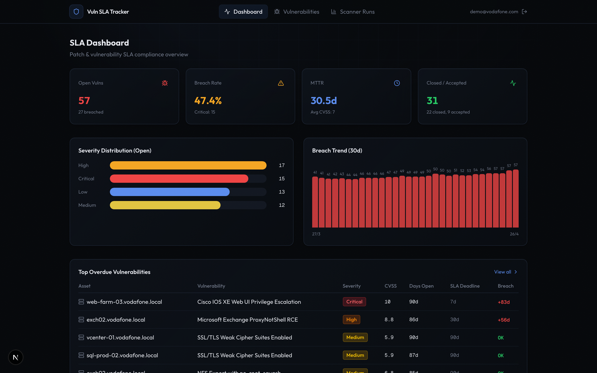
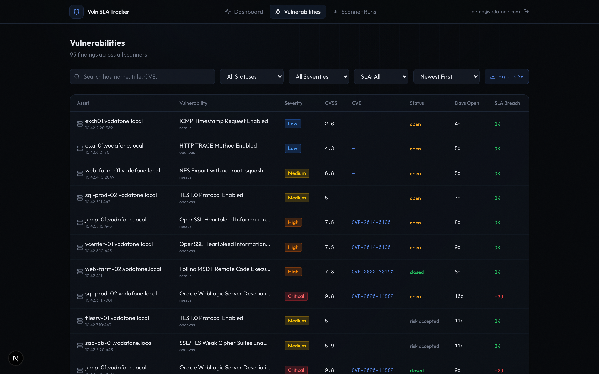
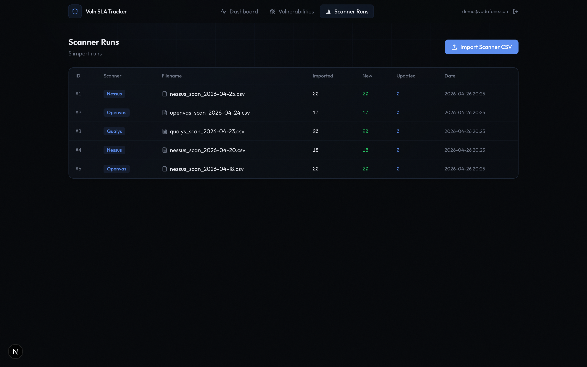

# Vuln SLA Tracker — Demo Walkthrough

Patch and vulnerability SLA breach tracking for Vodafone ITGC compliance. Ingests Nessus, OpenVAS, and Qualys scanner exports, applies SLA rules per CVSS severity, and surfaces breaches via an interactive dashboard.

## Quick Start

```bash
./start.sh
```

This seeds the database, starts the backend (port 8003) and frontend (port 3000). Open http://localhost:3000 and log in with `demo@vodafone.com` / `demo123`.

## Demo Pages

### 1. Login (`/login`)

Dark-themed sign-in page. Account auto-created on first seed.


### 2. Dashboard (`/`)

Four KPI cards at the top:
- **Open Vulns** — total + breached count
- **Breach Rate** — % of open vulns past their SLA deadline
- **MTTR** — mean time to remediate closed vulns
- **Closed / Accepted** — resolution counts

Below: severity distribution bar chart (Critical/High/Medium/Low), 30-day breach trend sparkline, and top overdue vulnerabilities table.




### 3. Vulnerabilities (`/vulnerabilities`)

Filterable table of all 95+ seeded findings. Filters:
- Search (hostname, title, CVE)
- Status (open, closed, risk accepted, false positive)
- Severity (Critical → Low)
- SLA breach (breached / compliant)
- Sort by newest, oldest, CVSS, hostname
- Paginated (50 per page)

Each row shows asset, vulnerability title, severity badge, CVSS score, CVE, status, days open, and SLA breach indicator (+Nd in red).

CSV export available via download button.




### 4. Scanner Runs (`/scanner-runs`)

Import history showing each scanner CSV ingestion — scanner type, filename, count of imported/new/updated vulns, and timestamp. CSV upload button for importing new scanner exports (supports Nessus, OpenVAS, Qualys formats).



## SLA Rules

| Severity | CVSS Range | Remediation Deadline |
|----------|-----------|---------------------|
| Critical | 9.0–10.0  | 7 days |
| High     | 7.0–8.9   | 30 days |
| Medium   | 4.0–6.9   | 90 days |
| Low      | 0.1–3.9   | 180 days |
| Info     | 0.0       | 365 days |

## API Endpoints

| Method | Path | Description |
|--------|------|-------------|
| GET | `/api/v1/dashboard/kpis` | SLA KPIs (breach rate, MTTR, severity breakdown) |
| GET | `/api/v1/dashboard/top-overdue` | Top N breached vulnerabilities |
| GET | `/api/v1/dashboard/breach-timeline` | Daily breach counts for trend chart |
| GET | `/api/v1/dashboard/severity-distribution` | Open vuln counts by severity |
| GET | `/api/v1/vulnerabilities` | List with search, filters, pagination, SLA enrichment |
| GET | `/api/v1/vulnerabilities/:id` | Single vuln detail with SLA fields |
| PATCH | `/api/v1/vulnerabilities/:id` | Update status (open/closed/risk_accepted/false_positive) |
| POST | `/api/v1/scanner/import` | Upload Nessus/OpenVAS/Qualys CSV |
| GET | `/api/v1/scanner/runs` | Import history |
| GET | `/api/v1/export/vulnerabilities` | CSV export |

## Seeded Data

- 95 vulnerabilities across 20 realistic Vodafone assets (DCs, Exchange, SQL, SAP, vSphere, web farms)
- 25 vulnerability templates (PrintNightmare, Log4Shell, EternalBlue, ProxyNotShell, Log4j, etc.)
- 5 scanner runs across Nessus, OpenVAS, and Qualys
- 57 open / 29 closed / 9 risk accepted — 61.4% breach rate, 21.5d MTTR
